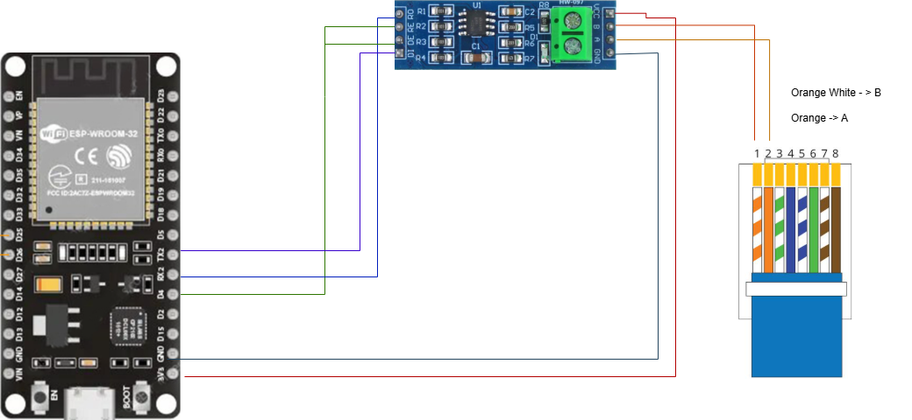

# ESP32 BMS RS485 MQTT Monitor

Monitor your LiFePO4 battery BMS over RS485 using an ESP32 and publish live data to MQTT. Designed for solar ESS setups with Modbus RTU BMS units connected via RJ45.

---



## Features

- Reads battery SOC, voltage, current, temperature, and charge status
- Publishes all values to MQTT individually and as a single JSON payload
- Auto-reconnects to WiFi and MQTT broker if connection is lost
- CRC validation with automatic retry on bad frames
- Sanity checks to discard misaligned or corrupt readings
- Non-blocking — no `delay()` in the main loop

---

## Hardware Required

| Component | Description |
|---|---|
| ESP32 DevKit V1 | 30-pin version |
| MAX485 module | TTL to RS485 converter |
| RJ45 cable | To connect to BMS RS485 port |
| Jumper wires | For connections |
| 120Ω resistor | Optional — termination resistor across A/B if cable is long |

---

## Wiring

```
ESP32               MAX485 Module           BMS RJ45
─────────────────────────────────────────────────────
GPIO17 (TX)  ──→──  DI
GPIO16 (RX)  ──←──  RO
GPIO4        ──→──  DE ──┐
                    RE ──┘  (tie DE and RE together)
3.3V         ──────  VCC
GND          ──────  GND
                    A (+)  ──────────────  RS485 A pin
                    B (−)  ──────────────  RS485 B pin
GND          ─────────────────────────── GND pin
```

> Check your BMS manual for the exact RJ45 pin assignments for RS485 A, B, and GND. Common pinouts use pins 1 & 2 for A/B and pin 8 for GND.

---

## BMS Compatibility

This code was developed and tested against a **LiFePO4 16-cell BMS with Modbus RTU over RS485**. The register map was reverse-engineered from live hex dumps.

| Register | Meaning | Formula |
|---|---|---|
| `0x0013` | Temperature | `(raw + 2480) / 100.0` °C |
| `0x0031` | Charge current | `raw / 10.0` A |
| `0x0032` | Discharge current | `raw / 10.0` A |
| `0x0033` | Pack voltage | `raw / 10.0` V |
| `0x0034` | SOC | `raw` % |
| `0x0037` | Capacity | `raw / 100.0` Ah |

> If your BMS uses a different register layout, use the raw hex dump mode in the code to discover your own register map. See [Finding Your Register Map](#finding-your-register-map) below.

---

## Software Setup

### 1. Install Arduino IDE

Download from [arduino.cc](https://www.arduino.cc/en/software)

### 2. Install ESP32 board support

In Arduino IDE go to `File → Preferences` and add this URL to Additional Board Manager URLs:

```
https://raw.githubusercontent.com/espressif/arduino-esp32/gh-pages/package_esp32_index.json
```

Then go to `Tools → Board → Board Manager`, search `esp32` and install **esp32 by Espressif Systems**.

### 3. Install PubSubClient library

Go to `Tools → Manage Libraries`, search **PubSubClient** and install **PubSubClient by Nick O'Leary**.

### 4. Configure the code

Open `bms_monitor.ino` and set your credentials at the top:

```cpp
#define WIFI_SSID     "your_wifi_ssid"
#define WIFI_PASSWORD "your_wifi_password"
#define MQTT_BROKER   "192.168.1.100"   // IP of your MQTT broker
#define MQTT_PORT     1883
#define MQTT_USER     ""                // leave empty if no auth
#define MQTT_PASS     ""
```

### 5. Select board and port

```
Tools → Board → ESP32 Arduino → ESP32 Dev Module
Tools → Port  → COMx (Windows) or /dev/ttyUSB0 (Linux/Mac)
```

### 6. Upload

Click **Upload** and open Serial Monitor at **115200 baud** to see live output.

---

## MQTT Topics

| Topic | Value | Example |
|---|---|---|
| `bms/soc` | Battery SOC % | `80` |
| `bms/voltage` | Pack voltage V | `26.8` |
| `bms/current` | Current A | `9.3` |
| `bms/temperature` | Temperature °C | `25.1` |
| `bms/status` | Charge status | `Charging` |
| `bms/data` | All values as JSON | `{"soc":80,"voltage":26.8,...}` |

### JSON payload format

```json
{
  "soc": 80,
  "voltage": 26.8,
  "current": 9.3,
  "temp": 25.1,
  "status": "Charging"
}
```

### Monitor all topics

```bash
mosquitto_sub -h 192.168.1.100 -t "bms/#" -v
```

---

## Home Assistant Integration

Add to your `configuration.yaml`:

```yaml
mqtt:
  sensor:
    - name: "Battery SOC"
      state_topic: "bms/soc"
      unit_of_measurement: "%"
      device_class: battery

    - name: "Battery Voltage"
      state_topic: "bms/voltage"
      unit_of_measurement: "V"
      device_class: voltage

    - name: "Battery Current"
      state_topic: "bms/current"
      unit_of_measurement: "A"
      device_class: current

    - name: "Battery Temperature"
      state_topic: "bms/temperature"
      unit_of_measurement: "°C"
      device_class: temperature

    - name: "Battery Status"
      state_topic: "bms/status"
```

---

## Serial Monitor Output

```
BMS monitor starting...
[WiFi] Connecting to MyNetwork...
[WiFi] Connected: 192.168.1.105
[MQTT] Connecting to 192.168.1.100:1883...
[MQTT] Connected

╔══════════════════════════╗
║       Battery BMS        ║
╠══════════════════════════╣
║  SOC         :  80 %     ║
║  Voltage     :  26.8 V   ║
║  Current     :   9.3 A   ║
║  Temperature :  25.1 C   ║
║  Status      : Charging  ║
╚══════════════════════════╝

[MQTT] bms/soc → 80 OK
[MQTT] bms/voltage → 26.8 OK
[MQTT] bms/current → 9.3 OK
[MQTT] bms/temperature → 25.1 OK
[MQTT] bms/status → Charging OK
[MQTT] bms/data → {"soc":80,...} OK
```

---

## Finding Your Register Map

If your BMS has a different register layout, enable raw dump mode to discover it. In `loop()` replace `decodeBMS()` with:

```cpp
printHexDump(resp, n);
```

This prints every byte in the response in hex and ASCII. To identify registers:

1. Note your current battery values (voltage, SOC, current, temperature)
2. Convert each value to hex — e.g. voltage 26.8V → 268 = `0x010C`
3. Search the hex dump for that byte pair
4. Each register is 2 bytes, data starts at `buf[3]`, register address = `(byteIndex - 3) / 2`

---

## Troubleshooting

**CRC fails sometimes**
- Increase the post-transmit delay in `sendModbus()` from 100µs to 500µs
- Add a 120Ω resistor across RS485 A and B terminals
- Use a shielded twisted-pair cable, keep away from inverter wiring
- Add a common GND wire between ESP32 and BMS

**No response from BMS**
- Swap RS485 A and B wires — polarity is often reversed
- Verify baud rate matches BMS (try 9600, 19200, 115200)
- Check DE and RE pins are tied together and connected to GPIO4
- Confirm RJ45 pinout against your BMS manual

**Values look wrong**
- Your BMS may use a different register map — use hex dump mode to find the correct registers
- Check scaling formula — some BMS units use different units (e.g. mV instead of 10mV)

**WiFi or MQTT keeps disconnecting**
- The code auto-reconnects — check Serial Monitor for reconnect messages
- Verify broker IP has not changed (use a static IP for the broker)

---

## Power Supply

The ESP32 needs a stable 5V supply. Options for a solar ESS installation:

| Option | Notes |
|---|---|
| USB wall adapter | Simplest |
| 12V → 5V buck converter | Tap from battery system 12V rail |
| PoE splitter | Single cable if you have a PoE switch nearby |
| USB power bank | Good for testing |

> The BMS RJ45 port carries RS485 signals only — it does not provide power.

---

## License

MIT License — free to use, modify, and distribute.

---

## Contributing

Pull requests welcome. If you get this working with a different BMS model, please open an issue with your register map so others can benefit.
